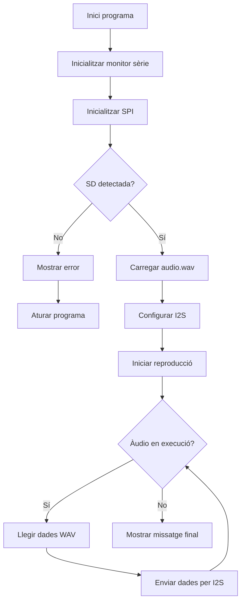

# Informe Pràctica 7B: Reproducció d'Àudio des de Targeta SD amb I2S

**Autors:** Joel Serrano i Ana Jimenez

**Microcontrolador:** ESP32-S3-DevKitC-1

---

## 1. Objectiu de la pràctica

L’objectiu d’aquesta pràctica és reproduir un arxiu d’àudio emmagatzemat en una targeta SD utilitzant el protocol I2S de l’ESP32-S3.

Per aconseguir-ho, hem combinat la comunicació SPI per accedir a la targeta SD i la comunicació I2S per enviar les dades d’àudio a un amplificador compatible connectat a un altaveu.

## 2. Desenvolupament de la pràctica

Per realitzar aquesta pràctica hem utilitzat una targeta SD per emmagatzemar un fitxer d’àudio en format WAV.

La comunicació amb la targeta SD es realitza mitjançant el bus SPI, mentre que la reproducció del so es duu a terme utilitzant el protocol I2S.

Per gestionar la reproducció s’han utilitzat les llibreries `AudioGeneratorWAV.h`, `AudioOutputI2S.h` i `AudioFileSourceSD.h`.

El sistema llegeix el fitxer d’àudio des de la targeta SD i envia les dades digitals a través de la interfície I2S cap a l’amplificador i l’altaveu.

## 3. Codi principal (`main.cpp`)

El següent codi inicialitza la targeta SD, carrega un fitxer WAV i el reprodueix utilitzant el protocol I2S.

```cpp
#include <Arduino.h>
#include <SD.h>
#include <SPI.h>
#include "AudioGeneratorWAV.h"
#include "AudioOutputI2S.h"
#include "AudioFileSourceSD.h"

#define SD_CS     10
#define SPI_MOSI  11
#define SPI_MISO  13
#define SPI_SCK   12

#define I2S_BCLK  5
#define I2S_LRC   6
#define I2S_DOUT  7

AudioFileSourceSD *file;
AudioGeneratorWAV *wav;
AudioOutputI2S    *out;

void setup() {

    Serial.begin(115200);
    delay(1000);

    Serial.println("Iniciant...");

    pinMode(SD_CS, OUTPUT);
    digitalWrite(SD_CS, HIGH);

    SPI.begin(SPI_SCK, SPI_MISO, SPI_MOSI);

    if (!SD.begin(SD_CS, SPI, 4000000)) {

        Serial.println("Error: SD no detectada");

        while (true) delay(1000);
    }

    Serial.println("SD OK!");

    file = new AudioFileSourceSD("/audio.wav");

    wav = new AudioGeneratorWAV();

    out = new AudioOutputI2S();

    out->SetPinout(I2S_BCLK, I2S_LRC, I2S_DOUT);

    out->SetGain(0.125);

    wav->begin(file, out);
}

void loop() {

    if (wav->isRunning()) {

        if (!wav->loop())
            wav->stop();

    } else {

        Serial.println("WAV finalitzat");

        delay(1000);
    }
}
```

## 4. Funcionament del codi

Primer inicialitzem la comunicació sèrie i configurem els pins utilitzats pel bus SPI.

Posteriorment, intentem inicialitzar la targeta SD utilitzant la funció `SD.begin()`. Si la targeta no és detectada, el programa mostra un missatge d’error i queda aturat.

Quan la targeta SD és reconeguda correctament, es carrega el fitxer `audio.wav` utilitzant l’objecte `AudioFileSourceSD`.

A continuació, es crea el generador d’àudio WAV i la sortida I2S. També es configuren els pins utilitzats per a la transmissió d’àudio i el nivell de volum.

Durant l’execució del programa, la funció `wav->loop()` s’encarrega de llegir contínuament les dades del fitxer WAV i enviar-les a través de la interfície I2S.

Quan la reproducció finalitza, es mostra un missatge informatiu pel monitor sèrie.

## 5. Sortida pel monitor sèrie

Quan executem el programa, el monitor sèrie mostra l’estat de la inicialització de la targeta SD i el final de la reproducció.

```text
Iniciant...

SD OK!

WAV finalitzat
```

L’àudio emmagatzemat a la targeta SD es reprodueix a través de l’altaveu connectat al sistema I2S.

## 6. Diagrama de flux del programa



## 7. Conclusions

Amb aquesta pràctica hem après a combinar els protocols SPI i I2S en un mateix projecte utilitzant la placa ESP32-S3.

També hem comprovat com reproduir arxius d’àudio emmagatzemats en una targeta SD i transmetre les dades digitals a un amplificador compatible.

Finalment, aquesta pràctica ens ha ajudat a entendre millor les aplicacions multimèdia de l’ESP32 i l’ús conjunt de diferents buses de comunicació.
